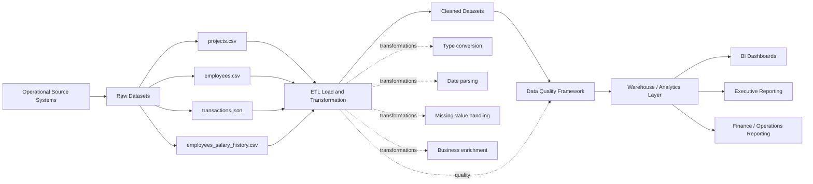

# Data Governance Document

## Presight — StackUp Engineering Academy Assessment

**Task:** 4.2 — Data Governance Document

**Generated:** 2026-08-30 17:28:57

> **Note:** This document is an assessment governance design. Where the supplied data does not provide actual production source-system metadata or statutory retention periods, the document explicitly marks the value as an assumption or item requiring confirmation.

---

# Section 1 — Data inventory

| Dataset | Source system | Format | Update frequency | Volume estimate | Daily growth |
|---|---|---|---|---:|---|
| projects | Project Management / Operational System | CSV | Batch extract; exact production frequency not provided | 500 rows in supplied snapshot | Not provided |
| employees | HR / Employee Management System | CSV | Batch extract; exact production frequency not provided | 1,000 rows in supplied snapshot | Not provided |
| transactions | Finance / Project Financial System | JSON | Batch extract; exact production frequency not provided | 50,000 rows in supplied snapshot | Not provided |
| employees_salary_history | HR / Payroll System | CSV | Batch extract; exact production frequency not provided | 1,826 rows in supplied snapshot | Not provided |

### Inventory notes

- The supplied assessment files are snapshots rather than live source-system feeds.
- Therefore, the row counts above represent the supplied snapshot volumes.
- Daily growth was not supplied and should be replaced with measured production ingestion statistics once available.
- The pipeline uses environment variables for the data and output locations, supporting deployment into different environments.

---

# Section 2 — Data classification

## Classification definitions

| Classification | Definition |
|---|---|
| **Public** | Non-sensitive, shareable externally |
| **Internal** | Internal use only, no regulatory requirement |
| **Confidential** | Sensitive business data — restricted access |
| **Personal (PII)** | Personal identifiable information — regulatory requirements apply |

## 2.1 Projects

| Column | Classification | Regulation | Rationale |
|---|---|---|---|
| project_id | Internal | No | Project identifier; not directly identifying a person. |
| project_name | Confidential | No | Business/project information. |
| department | Internal | No | Internal organisational information. |
| status | Internal | No | Internal project status. |
| start_date | Internal | No | Project lifecycle information. |
| end_date | Internal | No | Project lifecycle information. |
| budget | Confidential | No | Sensitive financial/business information. |
| actual_cost | Confidential | No | Sensitive financial/business information. |
| project_manager_id | Confidential | No | Internal employee reference. |
| priority | Internal | No | Internal project management information. |
| region | Internal | No | Business operational information. |

## 2.2 Employees

| Column | Classification | Regulation | Rationale |
|---|---|---|---|
| employee_id | Personal (PII) | GDPR + UAE PDPL | Persistent identifier relating to an employee. |
| full_name | Personal (PII) | GDPR + UAE PDPL | Directly identifies an individual. |
| email | Personal (PII) | GDPR + UAE PDPL | Employee contact identifier. |
| department | Internal | No | Organisational information. |
| role | Internal | No | Employment information. |
| level | Confidential | No | Employment classification information. |
| hire_date | Personal (PII) | GDPR + UAE PDPL | Date associated with an identifiable employee. |
| salary | Personal (PII) | GDPR + UAE PDPL | Employee compensation information. |
| manager_id | Personal (PII) | GDPR + UAE PDPL | Identifier linking an employee to another individual. |
| region | Internal | No | Operational/geographical employment information. |
| status | Confidential | No | Employment status. |
| years_experience | Personal (PII) | GDPR + UAE PDPL | Employment-related information associated with an individual. |

## 2.3 Transactions

| Column | Classification | Regulation | Rationale |
|---|---|---|---|
| transaction_id | Confidential | No | Financial transaction identifier. |
| project_id | Confidential | No | Internal project reference. |
| vendor_id | Confidential | No | Business/vendor identifier. |
| vendor_name | Confidential | No | Business/vendor information. |
| category | Internal | No | Transaction category. |
| amount | Confidential | No | Financial transaction amount. |
| currency | Internal | No | Currency metadata. |
| transaction_date | Confidential | No | Financial transaction timing. |
| approved_by | Personal (PII) | GDPR + UAE PDPL | Employee identifier associated with approval. |
| payment_status | Confidential | No | Financial/payment information. |
| invoice_ref | Confidential | No | Financial document reference. |
| notes | Confidential | Potentially PII; classify based on content | Free-text can contain business or personal information. |

## 2.4 Employees salary history

| Column | Classification | Regulation | Rationale |
|---|---|---|---|
| employee_id | Personal (PII) | GDPR + UAE PDPL | Employee identifier. |
| previous_salary | Personal (PII) | GDPR + UAE PDPL | Historical compensation information. |
| new_salary | Personal (PII) | GDPR + UAE PDPL | Compensation information. |
| previous_role | Confidential | No | Historical employment information. |
| new_role | Confidential | No | Employment information. |
| previous_level | Confidential | No | Historical employment classification. |
| new_level | Confidential | No | Employment classification. |
| effective_date | Personal (PII) | GDPR + UAE PDPL | Employment event date linked to an individual. |
| change_type | Confidential | No | Employment change information. |
| change_reason | Confidential | Potentially PII; classify based on content | Reason text may reveal sensitive employment information. |

### PII regulatory treatment

Employee identifiers, names, contact information, compensation and employment-related information are treated as personal data where they relate to an identifiable individual.

- **GDPR:** applies where the organisation is processing personal data within the GDPR's territorial or other applicable scope.
- **UAE PDPL:** applies where processing falls within the territorial or other applicable scope of UAE Federal Decree-Law No. 45 of 2021.
- Where both regimes apply, the stricter applicable control should be used unless Legal/Privacy determines otherwise.
- Free-text fields such as `notes` and `change_reason` require additional content-aware review because users may enter personal or sensitive information.

---

# Section 3 — Data ownership

| Dataset | Data Owner (role) | Data Steward (role) | Access approver |
|---|---|---|---|
| projects | Head of Project Management / Operations | Project Data Steward | Data Governance / Project Management |
| employees | HR Director / HR Data Owner | HR Data Steward | HR Data Owner |
| transactions | Finance Director / CFO | Finance Data Steward | Finance Data Owner |
| employees_salary_history | HR Director / Payroll Owner | HR / Payroll Data Steward | HR Director / Payroll Owner |

## Owner vs. Steward

**Data Owner** is the accountable business role responsible for the dataset, including deciding its business purpose, acceptable use, classification, retention and who should have access.

**Data Steward** is the operational role responsible for maintaining data quality, metadata, definitions, issue resolution and day-to-day governance on behalf of the Data Owner.

---

# Section 4 — Retention policy

| Dataset | Retention period | Justification | Disposal method | Who enforces |
|---|---|---|---|---|
| projects | 7 years after project closure | Supports project history, financial analysis, audits and management reporting. Final period should be aligned with the organisation's contractual, accounting and legal requirements. | Archive first; securely delete when retention expires unless a legal hold applies. | Data Owner with Data Governance and IT |
| employees | Employment period + 7 years | Supports HR administration, employment records, audits and potential legal claims. Exact statutory period should be validated against applicable employment and privacy requirements. | Anonymise for long-term analytics where possible; securely delete identifiable records after approved retention period. | HR Data Owner with Data Governance and IT |
| transactions | 7 years | Supports accounting, financial controls, audit, reconciliation and investigation requirements. Final period should be validated against applicable accounting/tax requirements. | Archive financial records; securely delete when legally permissible and no audit/legal hold remains. | Finance Data Owner with Data Governance and IT |
| employees_salary_history | Employment period + 7 years minimum; extend where applicable law, payroll, tax, audit or legal-hold requirements require longer | Historical salary information supports payroll reconciliation, employment claims, audits and statutory obligations. Salary history is highly sensitive personal data and should not be retained indefinitely without a defined purpose. | Restricted archive followed by secure deletion/anonymisation when the approved legal/business retention period expires. | HR/Payroll Data Owner with Data Governance, Legal and IT |

## Salary history special consideration

`employees_salary_history.csv` contains historical compensation information and therefore receives stronger controls than ordinary project data.

Salary history should be retained for as long as there is a documented business, payroll, audit, tax, employment-claim or legal requirement. The organisation should confirm the exact statutory retention period with Legal/HR/Finance rather than assuming that one universal UAE labour or tax period applies to every record.

After the approved retention period expires, identifiable salary history should be securely deleted or anonymised. Legal holds must suspend normal deletion until the hold is released.

---

# Section 5 — Access control

| Persona | Projects | Employees | Transactions | Salary History |
|---|---|---|---|---|
| Data Engineer | Read + Write | Read + Write | Read + Write | None |
| BI Analyst | Read | Read | Read | None |
| Finance Team | Read | None | Read + Write | None |
| HR Team | Read | Read + Write | None | Read |
| Executive | Read | Read | Read | None |

### Access-level definitions

- **None** — no access.
- **Read** — can view/query data but cannot change it.
- **Read + Write** — can view and modify approved records.
- **Full (including delete)** — unrestricted administrative access, including deletion.

### Least-privilege rationale

Salary history is particularly sensitive because it contains individual compensation information. Most personas therefore have **None** access.

- Data Engineers do not need salary history access for routine ETL unless their assigned pipeline explicitly requires it. Where access is necessary, it should be time-bound and audited.
- BI Analysts should use aggregated or anonymised salary metrics rather than individual salary history.
- Finance normally needs transaction data but does not need individual HR salary history for ordinary finance reporting.
- HR/Payroll requires controlled read access for employment and payroll purposes.
- Executives should receive aggregated compensation reporting rather than individual salary history.

Administrative access should be separately controlled and audited. Production deletion should require elevated approval and should not be granted to ordinary analytical users.

---

# Section 6 — Data lineage

### Transformation and quality-control points

1. **Raw ingestion:** source files are loaded without changing the source files.
2. **Transformation:** data types, dates, text fields and business-derived attributes are standardised.
3. **Cleaning:** identified employee data-quality problems are corrected where a deterministic correction is possible.
4. **Enrichment:** transactions are joined with project and employee context.
5. **Data quality:** completeness, uniqueness, numeric validity, date validity, consistency, referential integrity and additional configurable checks are run.
6. **Warehouse/reporting:** only cleaned and quality-checked datasets should be promoted to analytical consumption.

---

# Governance principles

The governance design follows:

- Least privilege
- Purpose limitation
- Data minimisation
- Separation of duties
- Auditable access
- Retention and secure disposal
- Privacy-by-design
- Quality checks before analytical publication

**Document owner:** Data Governance / Data Management

**Review frequency:** At least annually and whenever a source system, regulation, business purpose or data classification materially changes.
