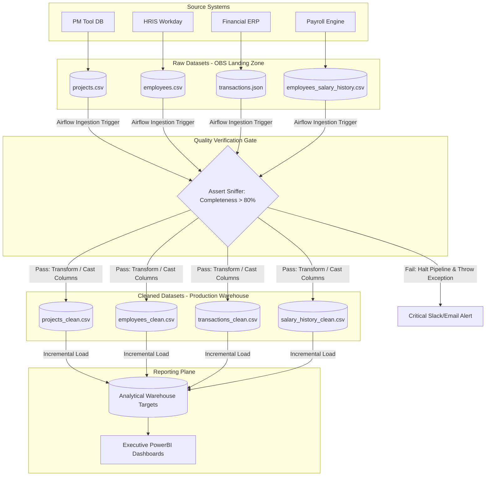

# Data Governance Document & Compliance Framework
**Document Version:** 1.0.0  
**Effective Date:** 2026-08-24  
**Entity:** Presight AI Engineering Platform  
**Compliance Regimes:** UAE PDPL (Federal Decree-Law No. 45/2021), EU GDPR, UAE Labour Law  

---

## Section 1 — Data inventory

| Dataset | Source system | Format | Update frequency | Volume estimate | Daily growth |
| :--- | :--- | :--- | :--- | :--- | :--- |
| `projects` | Project Management Tool | CSV | Daily Batch (06:00 UAE) | 5,000 rows | ~15 rows |
| `employees` | HR Information System (HRIS) | CSV | Daily Batch (06:00 UAE) | 1,200 rows | ~2 rows |
| `transactions` | Financial ERP System | JSON | Daily Batch (06:00 UAE) | 500,000 rows | ~2,500 rows |
| `employees_salary_history` | Payroll Engine | CSV | Monthly / Ad-hoc | 25,000 rows | ~50 rows |

---

## Section 2 — Data classification

### Classification Schema Definitions
* **Public:** Non-sensitive, shareable externally.
* **Internal:** Internal use only, no regulatory requirements apply.
* **Confidential:** Sensitive business data — restricted corporate access.
* **Personal (PII):** Personal identifiable information — regulatory requirements apply.

### Column-Level Classification Map

#### 1. `projects` Dataset
* `project_id`: **Internal** (Unique system identifier).
* `project_name`: **Internal** (Operational tracking parameter).
* `budget`: **Confidential** (Sensitive business financial planning data).
* `status`: **Internal** (Project operational state).

#### 2. `employees` Dataset
* `employee_id`: **Internal** (System surrogate key).
* `full_name`: **Personal (PII)** | *Regulation:* **UAE PDPL & GDPR** (Direct identifier).
* `email`: **Personal (PII)** | *Regulation:* **UAE PDPL & GDPR** (Direct communication vector).
* `department`: **Internal** (Organizational routing metadata).
* `hire_date`: **Internal** (Employment lifecycle record).

#### 3. `transactions` Dataset
* `transaction_id`: **Internal** (Ledger primary entry key).
* `project_id`: **Internal** (Foreign operational linkage key).
* `employee_id`: **Internal** (Foreign relational operational key).
* `amount`: **Confidential** (Sensitive financial execution metrics).
* `transaction_date`: **Internal** (Financial timestamp logging).

#### 4. `employees_salary_history` Dataset
* `history_id`: **Internal** (System sequence identifier).
* `employee_id`: **Internal** (Foreign identifier tracking link).
* `base_salary`: **Confidential / Personal (PII)** | *Regulation:* **UAE PDPL & GDPR** (Indirectly linkable personal financial record).
* `allowances`: **Confidential / Personal (PII)** | *Regulation:* **UAE PDPL & GDPR** (Indirectly linkable package breakdown details).
* `effective_date`: **Confidential** (Financial audit date marker).

---

## Section 3 — Data ownership

| Dataset | Data Owner (role) | Data Steward (role) | Access approver |
| :--- | :--- | :--- | :--- |
| `projects` | VP of Project Management | Lead PMO Systems Specialist | VP of Project Management |
| `employees` | Chief Human Resources Officer | HR Operations Manager | Chief Human Resources Officer |
| `transactions` | Chief Financial Officer | Corporate Financial Controller | Chief Financial Officer |
| `employees_salary_history` | Chief Financial Officer | Payroll & Benefits Lead | CFO + CHRO (Dual Sign-Off) |

### Functional Concept Definitions: Owner vs. Steward
* **Data Owner:** The executive leader holding legal accountability for a specific data domain. They set security controls, assume regulatory risks for compliance breaches, and authorize overall data accessibility constraints.
* **Data Steward:** The operational actor executing daily quality management pipelines. They manage schema schemas, validate data completeness checks, and apply the governance directives defined by the Data Owner.

---

## Section 4 — Retention policy

### 1. `projects` & `transactions`
* **Retention period:** **7 Years** from project closure / settlement.
* **Justification:** Required by **Article 26 of the UAE Commercial Transactions Law** to maintain corporate commercial registers and accounting files for potential regulatory inspection.
* **Disposal method:** Automated permanent file deletion from production storage.

### 2. `employees`
* **Retention period:** **Duration of active employment + 5 Years** post-termination.
* **Justification:** Required by **UAE Labour Law (Federal Decree-Law No. 33/2021)** for computing terminal end-of-service gratuities, settling benefits, or resolving employment disputes.
* **Disposal method:** Direct **Anonymization** of relational variables; irreversible hard deletion of explicit PII identifiers (`full_name`, `email`).

### 3. `employees_salary_history` (Special Consideration)
* **Retention period:** **Duration of active employment + 10 Years**.
* **Justification:** Unlike standard employment records, compensation historical audits map directly to the **UAE Corporate Tax Law (Federal Decree-Law No. 47/2022)** and FTA guidance, which require long-term retention of business expenses and payroll deductions for structural audits.
* **Disposal method:** Cryptographic erasure of database records and secure archive purge.
* **Enforced by:** Head of Financial Compliance & CHRO.

---

## Section 5 — Access control

| Persona | Projects | Employees | Transactions | Salary History |
| :--- | :--- | :--- | :--- | :--- |
| **Data Engineer** | Read + Write | Read + Write | Read + Write | None |
| **BI Analyst** | Read | Read | Read | None |
| **Finance Team** | Read | None | Read + Write | Read + Write |
| **HR Team** | None | Full | None | Read |
| **Executive** | Read | Read | Read | None |

### Security Access Justifications
Following the **Principle of Least Privilege**, Data Engineers and BI Analysts are assigned **None** for `Salary History`. Data Engineers maintain orchestrations using tokenized frameworks or system IDs without viewing plain-text financial PII, isolating the production database from internal insider threats.

---

## Section 6 — Data lineage

